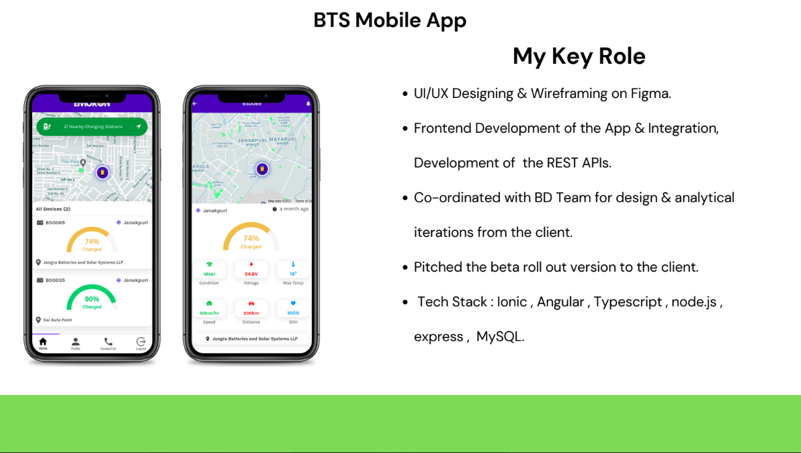

# 🔋 Battery Tracking App

A comprehensive mobile and web application developed to showcase live data points for fleet operators, enabling real-time tracking, immobilization, and geofencing. Designed as part of the core development team, the app integrates advanced features to enhance user experience and provide a competitive commercial edge.

---

## 📸 Screenshots

### BTS Mobile App:

### BTS Web App

---

## 🛠️ Tech Stack

- **Frontend**: Angular, JavaScript
- **Backend**: Node.js
- **API Integration**: REST APIs, Google Maps API
- **Database**: SQL

---

## 🚀 Features

- **Live Data Visualization**: Displays live data points for fleet operators, offering real-time updates.
- **Core Functionalities**:
  - **Immobilization**: Allows fleet operators to remotely disable vehicles for enhanced security.
  - **Geofencing**: Triggers alerts when vehicles move outside predefined geographic boundaries.
- **Extensive UI/UX Design**: Wireframed and designed a user-friendly interface for seamless interactions.
- **Collaborative Development**: Worked cross-functionally with founders, marketing teams, and stakeholders.
- **App Demos**: Successfully pitched app functionalities to potential clients.

---
